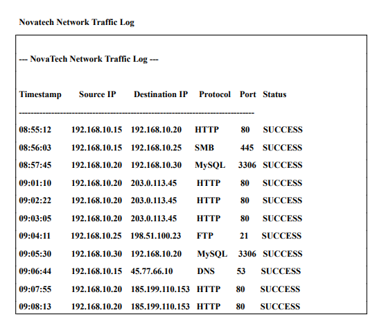
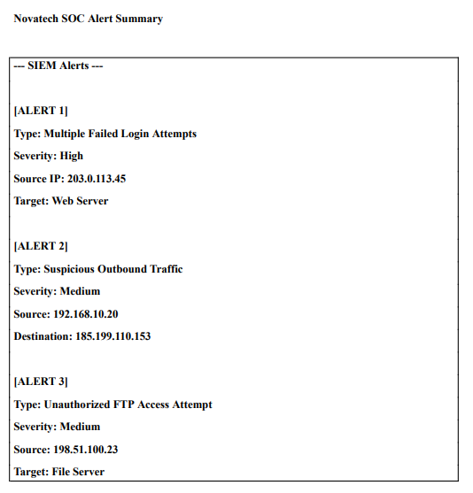
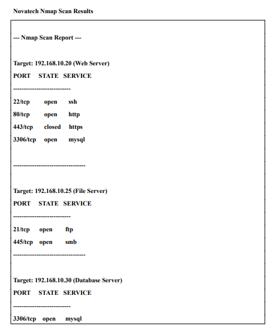
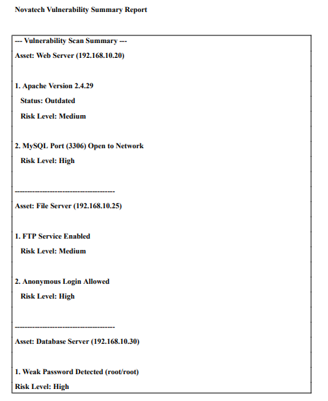

# NovaTech Solutions Security Assessment (Capstone Project)

**Project Overview**  
Conducted a comprehensive end-to-end security assessment for NovaTech Solutions, a fictional technology consulting company facing suspicious security events including brute-force attacks and misconfigured services.

**Scope**
- Network architecture analysis
- SOC alert & authentication log investigation  
- Vulnerability assessment (Nmap interpretation)
- Risk assessment
- Security recommendations

**Tools & Techniques**
- Network Traffic Log Analysis
- Authentication Log Analysis
- Nmap Scan Interpretation
- SIEM Alert Triage
- Risk Assessment Methodology

**Key Findings**
- Brute-force attack on Web Server from external IP `203.0.113.45`
- Successful lateral movement from Web Server to Database Server (root login)
- Exposed MySQL port 3306 and FTP with anonymous login
- Outdated Apache 2.4.29 on Web Server
- Weak password policy and lack of MFA

**Screenshots**

.png)

**Risk Assessment**

| Asset                | Threat                        | Risk Level | Recommendation                     |
|----------------------|-------------------------------|------------|------------------------------------|
| Web Server           | Brute-force + RCE             | High       | Enable MFA + patch Apache          |
| Database Server      | Unauthorized MySQL access     | High       | Restrict port 3306                 |
| File Server          | Anonymous FTP                 | High       | Disable anonymous login            |

**Recommendations**
- Enable MFA on all critical accounts
- Restrict database access
- Disable anonymous FTP
- Upgrade outdated software
- Configure HTTPS on the web server

**Conclusion**  
This capstone project integrated networking, SOC analysis, vulnerability assessment, and risk management skills — demonstrating a full cybersecurity assessment workflow.
